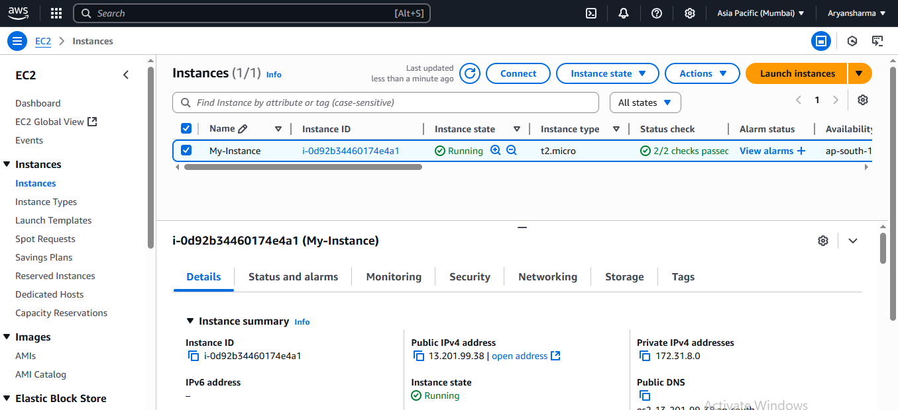

# 🚀 Automated Website Deployment with GitHub Actions CI/CD

This repository demonstrates a complete CI/CD pipeline that automatically deploys a website to an **AWS EC2 instance** every time new code is pushed to the `main` branch. The entire automation is orchestrated using **GitHub Actions**, showcasing a modern, push-to-deploy workflow.

---
## 🛠️ Core Technologies

-   **CI/CD:** GitHub Actions
-   **Cloud Provider:** Amazon Web Services (AWS)
-   **Compute:** AWS EC2 (Ubuntu Server)
-   **Web Server:** Apache2
-   **Deployment Method:** SSH & `rsync`
-   **Version Control:** Git & GitHub

---
## 🧱 Architecture & Workflow

The workflow is triggered by a `git push` to the main branch. A **GitHub Actions runner** checks out the latest code, establishes a secure SSH connection to the **AWS EC2 instance**, and uses `rsync` to efficiently transfer only the changed files to the web server's document root. The updated website is then served to the public by Apache.

---
## ✨ Project Showcase & Visual Guide

This visual walkthrough highlights the key components of the automated deployment pipeline.

### **1. The GitHub Actions Workflow File**
The heart of the automation is the `deploy.yml` file, which defines the steps for the CI/CD pipeline: checking out code, setting up SSH, and deploying with `rsync`.

### **2. Configuring Repository Secrets**
Sensitive information like the server's IP address and private SSH key are securely stored as encrypted secrets in the GitHub repository settings.

### **3. The Live Website**
The final result is the website, which is automatically updated and served by the Apache server on the EC2 instance.

### **4. Successful Deployment Log**
The GitHub Actions "Actions" tab provides detailed logs for each deployment, showing a successful run of the workflow.

### **5. Verifying on the EC2 Server**
Connecting to the EC2 instance via SSH confirms that the website files have been successfully copied to the Apache webroot (`/var/www/html`).

---
## 📋 How to Replicate This Setup

### **1. Prepare the AWS EC2 Instance**
-   Launch an **Ubuntu EC2 instance**.
-   Install Apache: `sudo apt update && sudo apt install apache2 -y`.
-   Ensure the EC2 Security Group allows inbound traffic on port **80 (HTTP)** and **22 (SSH)**.
-   Generate an SSH key pair. Add the public key to the `~/.ssh/authorized_keys` file on the EC2 instance for the `ubuntu` user.

### **2. Configure GitHub Repository Secrets**
In your GitHub repository, navigate to **Settings > Secrets and variables > Actions** and add the following four repository secrets:
-   `EC2_HOST`: The public IP address of your EC2 instance.
-   `EC2_USER`: The username for the EC2 instance (e.g., `ubuntu`).
-   `EC2_KEY`: The **private** SSH key that corresponds to the public key you added to the EC2 instance.
-   `TARGET_DIR`: The destination directory on the server (e.g., `/var/www/html`).

### **3. Create the GitHub Actions Workflow**
-   Create a file at `.github/workflows/deploy.yml` in your repository.
-   Add the YAML configuration for the deployment workflow (as shown in the image above or in the repository).

### **4. Push to Deploy**
Commit your website files to the `website/` directory and push your changes to the `main` branch. The GitHub Actions workflow will automatically trigger and deploy your site.

---
## 👨‍💻 Author

**Aryan Sharma**
-   **B.Tech CSE (AI & DS)** | Poornima University
-   **Location:** Jaipur, Rajasthan, India
-   **GitHub:** [@AryanSharma2206](https://github.com/AryanSharma2206)
-   **LinkedIn:** [linkedin.com/in/aryan-sharma-a2a240353](https://www.linkedin.com/in/aryan-sharma-a2a240353)
